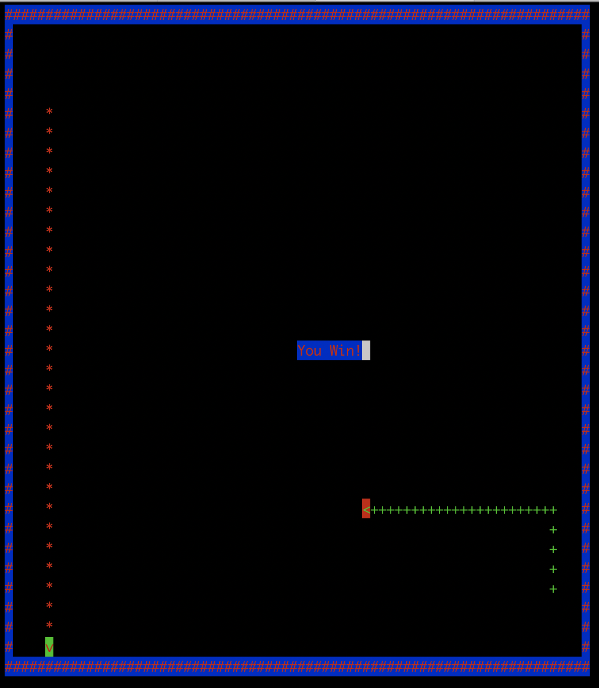

Tron Light Cycles In Curses!
============================

Just what you always wanted.



Note:  make sure the client terminal has <x,y> text dimensions at least
       as big as the servers.

Building:
```bash
% make clean
.........
% make
```

Running:
-------
Start the server player:

`% ./fun`

This will print out a port number and wait for the client to connect.

Start the client:

`% ./fun <hostname of server> <port server printed>`

The game will start immediately, arrow keys control the motion.  Do not
turn back into your stream, the walls, or the other players stream.  Never
do a 180 degree turn (ie: going up and turning down) or you will lose.
